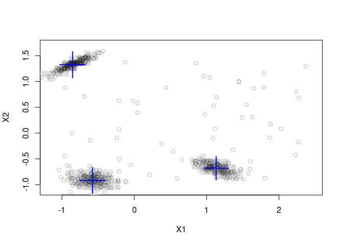

#  R package stream - Infrastructure for Data Stream Mining

[](https://CRAN.R-project.org/package=stream)
[](https://mhahsler.r-universe.dev/ui#package:stream)
[](https://CRAN.R-project.org/package=stream)

The package provides support for modeling and simulating data streams as
well as an extensible framework for implementing, interfacing and
experimenting with algorithms for various data stream mining tasks. The
main advantage of stream is that it seamlessly integrates with the large
existing infrastructure provided by R. The package currently focuses on
data stream clustering and provides implementations of **BICO**,
**BIRCH**, **D-Stream**, **DBSTREAM**, and **evoStream**.

Additional packages in the stream family are:

-   [streamMOA](https://github.com/mhahsler/streamMOA): Interface to
    clustering algorithms implemented in the
    [MOA](https://moa.cms.waikato.ac.nz/) framework. The package
    includes implementations of **DenStream**, **ClusTree** and
    **CluStream**.
-   [rEMM](https://github.com/mhahsler/rEMM): Provides implementations
    of **threshold nearest neighbor clustering** (tNN) and **Extensible
    Markov Model** (EMM) for modelling temporal relationships between
    clusters.

## Installation

**Stable CRAN version:** Install from within R with

``` r
install.packages("stream")
```

**Current development version:** Install from
[r-universe.](https://mhahsler.r-universe.dev/ui#package:stream)

``` r
install.packages("stream", repos = "https://mhahsler.r-universe.dev")
```

## Usage

Load the package and a random data stream with 3 Gaussian clusters and
10% noise.

``` r
library("stream")
set.seed(2000)

stream <- DSD_Gaussians(k = 3, noise = 0.1)
plot(stream)
```

<!-- -->

Cluster a stream of 1000 points using D-Stream.

``` r
dstream <- DSC_DStream(gridsize = 0.1)
update(dstream, stream, 1000)
plot(dstream, stream, grid = TRUE)
```

<!-- -->

## Acknowledgements

The development of the stream package was supported in part by NSF
IIS-0948893, NSF CMMI 1728612, and NIH R21HG005912.

## References

-   Michael Hahsler, Matthew Bolaños, and John Forrest. [stream: An
    extensible framework for data stream clustering research with
    R.](https://dx.doi.org/10.18637/jss.v076.i14) *Journal of
    Statistical Software,* 76(14), February 2017.
-   [stream package
    vignette](https://cran.r-project.org/package=stream/vignettes/stream.pdf)
    with complete examples.
-   [stream reference
    manual](https://cran.r-project.org/package=stream/stream.pdf)
